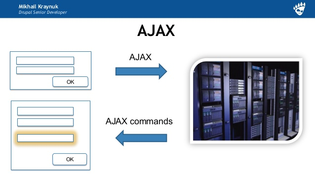
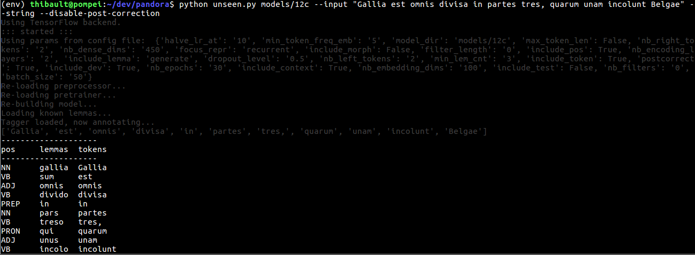
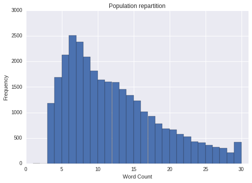
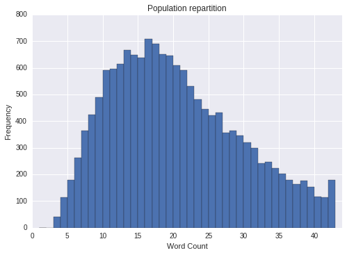
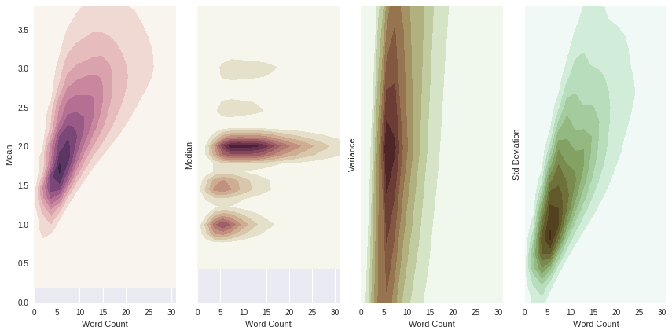
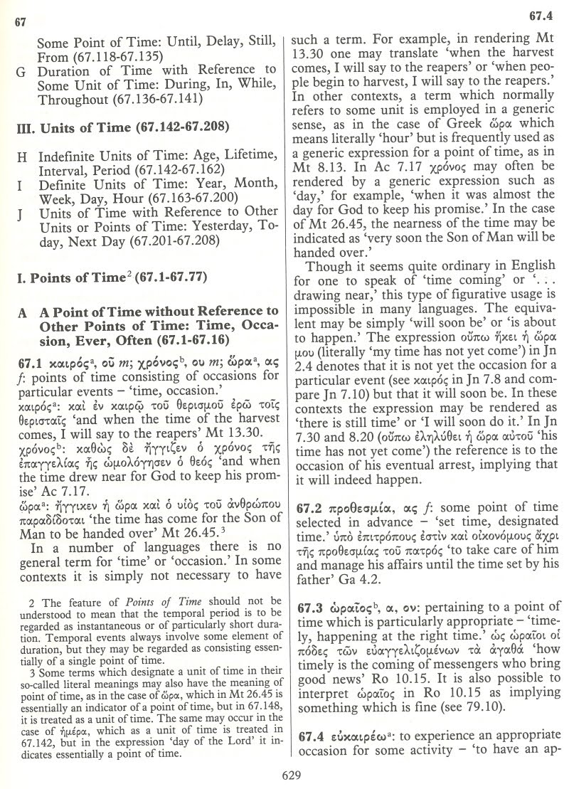
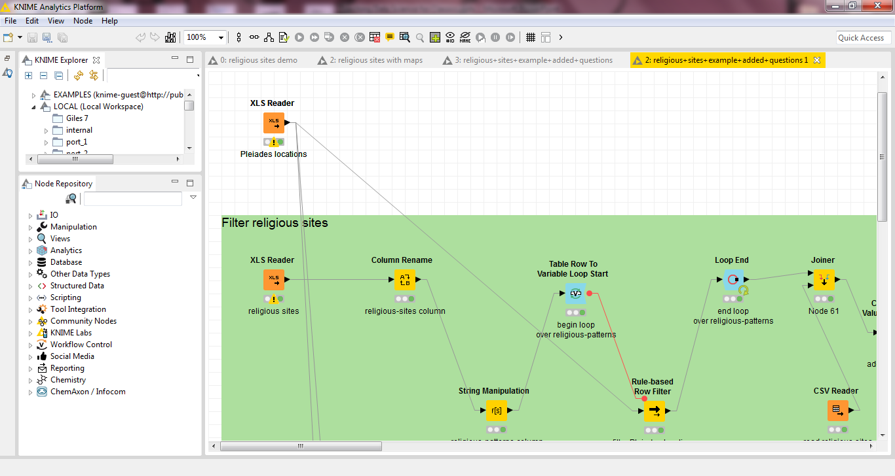
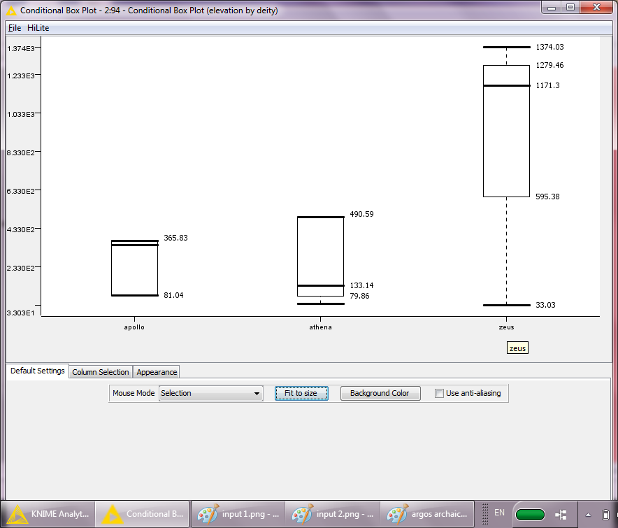

class: top 
Produire des données en Sciences de l'Antiquité avec Perseids
=== 

.subtitle[Comment et pour quoi faire ?]

.author[Thibault Clérice ( prénom\.nom\[at\]uni-leipzig.de )] 

.author[Github/Twitter : @ponteineptique] 

[https://goo.gl/rPlSth](http://ponteineptique.github.io/presentations/2017-04-10--Produire-des-donnees-avec-perseids/)

---
class: top
# Objectifs

- Présenter Perseids et les différents points qui font sa fondation
	1. Le Projet
	2. Publier
	3. API
	4. Standards
- Les outils de Perseids
	1. Éditer
	2. Annoter (Plokamos)
	2. Analyser (Arethusa)
- Utiliser les données de Perseids : des exemples
	1. Valorisation du Patrimoine
	2. Apprendre le latin et le grec à une machine
	3. Valeurs sémantiques
	4. Utilisations d'outils : attention !
- Conclusion

---
class: top

Disclaimer
==========


???

- Avant toute chose, je souhaiterai avertir quant à mes compétences. 
- Je ne suis pas un développeur actuel de Perseids. 
- Je travaille avec cet outil pour le Treebank
- je collabore avec leurs développeuses et développeur
- Une bonne partie des logiciels utilisés comme base sont de moi, sauf Sosol

---
class: top
# Qu'est-ce que Perseids ?

## Administrativement

- financé par la A. W. Mellon Fundation, NEH et Tufts
- monté à Tufts
- enfant/frère de la Perseus Digital Library
- dans sa troisième phase (2 ans/phase)
- dirigé par Marie-Claire Beaulieu et Bridget Almas

## Ses objectifs

- Introduire dans les cours licence/master la notion de publication
- Arrêter d'abandonner les données de l'enseignement et de la recherche
- Aider des projets ou des chercheur.se.s à mettre en place leur recherche dans un ENT

???

Commencer par un rapide condensé de ce qu'est Perseids
Contexte Nord-Américain (minor, major, carrières diverses)

---
class: top
## Comment fonctionne la publication d'un article universitaire

.left[]

Le processus de publication est complètement intégré à Perseids et est réutilisé par d'autres projets tels que Eagle-network.eu, Syriaca.org, Sematia.

???

Ce système du publication est mis à disposition des chercheur-se-s, projets et étudiant-e-s entre autres pour favoriser la collaboration.

---
class: top
## API

- Application Programming Interface, Interface de Programmation 
- Utilisé par les machines pour communiquer avec des machines


???

Je parlerai souvent d'API dans le contexte de ma présentation aussi il me semble normal d'introduire ce concept en amont.

Une API, Application Programming Interface, permet à une machine de communiquer avec une autre machine. On ne parle bien sûr pas là de discours autonome au coin du disque dur. Il s'agit pour un-e chercheur-se de communiquer avec un service et d'en extraire l'information dont il a besoin pour faire sa recherche.

---
class: top

## API vs. Interface Utilisateur [1]

[Homer, Odyssey, 9.1](http://www.perseus.tufts.edu/hopper/text?doc=Perseus%3Atext%3A1999.01.0135%3Abook%3D9%3Acard%3D1)


???

Voici une interface utilisateur basique, connue de tous, quoiqu'un peu vieillie

---
class: top

## API vs. Interface Utilisateur [2]


---
class: top

## API vs. Interface Utilisateur [3]


---
class: top

## API vs. Interface Utilisateur [4]

[http://ctsstage.dh.uni-leipzig.de/api/cts?request=GetPassagePlus&urn=urn:cts:greekLit:tlg0012.tlg002.perseus-grc2:9.1-9.46](http://ctsstage.dh.uni-leipzig.de/api/cts?request=GetPassagePlus&urn=urn:cts:greekLit:tlg0012.tlg002.perseus-grc2:9.1-9.46)

```xml
<?xml version="1.0" encoding="UTF-8"?>
<GetPassagePlus>
   <request>
      <requestName>GetPassagePlus</requestName>
      <requestUrn>urn:cts:greekLit:tlg0012.tlg002.perseus-grc2:9.1-9.46</requestUrn>
   </request>
   <reply>
      <urn>urn:cts:greekLit:tlg0012.tlg002.perseus-grc2:9.1-9.46</urn>
      <passage>
         <TEI>
            <text>
               <body>
                  <div type="edition" n="urn:cts:greekLit:tlg0012.tlg002.perseus-grc2" xml:lang="grc">
                     <div n="9" type="textpart" subtype="book">
                        <l n="1">τὸν δʼ ἀπαμειβόμενος προσέφη πολύμητις Ὀδυσσεύς·</l>
                        <q type="unspecified">
                           <l n="2">Ἀλκίνοε κρεῖον, πάντων ἀριδείκετε λαῶν,</l>
                           <l n="3">ἦ τοι μὲν τόδε καλὸν ἀκουέμεν ἐστὶν ἀοιδοῦ</l>
                           <l n="4">τοιοῦδʼ οἷος ὅδʼ ἐστί, θεοῖς ἐναλίγκιος αὐδήν.</l>
                           <l n="5">οὐ γὰρ ἐγώ γέ τί φημι τέλος χαριέστερον εἶναι</l>
                           <l n="6">ἢ ὅτʼ ἐυφροσύνη μὲν ἔχῃ κάτα δῆμον ἅπαντα,</l>
                           <l n="7">δαιτυμόνες δʼ ἀνὰ δώματʼ ἀκουάζωνται ἀοιδοῦ</l>
                           <l n="8">ἥμενοι ἑξείης, παρὰ δὲ πλήθωσι τράπεζαι</l>
                           <l n="9">σίτου καὶ κρειῶν, μέθυ δʼ ἐκ κρητῆρος ἀφύσσων</l>
                           <l n="10">οἰνοχόος φορέῃσι καὶ ἐγχείῃ δεπάεσσι·</l>
                           <l n="11">τοῦτό τί μοι κάλλιστον ἐνὶ φρεσὶν εἴδεται εἶναι.</l>
                           <l n="12">σοὶ δʼ ἐμὰ κήδεα θυμὸς ἐπετράπετο στονόεντα</l>
                           <l n="13">εἴρεσθʼ, ὄφρʼ ἔτι μᾶλλον ὀδυρόμενος στεναχίζω·</l>
                           <l n="14">τί πρῶτόν τοι ἔπειτα, τί δʼ ὑστάτιον καταλέξω;</l>
                           <l n="15">κήδεʼ ἐπεί μοι πολλὰ δόσαν θεοὶ Οὐρανίωνες.</l>
                           <l n="16">νῦν δʼ ὄνομα πρῶτον μυθήσομαι, ὄφρα καὶ ὑμεῖς</l>
                           <l n="17">εἴδετʼ, ἐγὼ δʼ ἂν ἔπειτα φυγὼν ὕπο νηλεὲς ἦμαρ</l>
                           <l n="18">ὑμῖν ξεῖνος ἔω καὶ ἀπόπροθι δώματα ναίων.</l>
                           <l n="19">εἴμʼ Ὀδυσεὺς Λαερτιάδης, ὃς πᾶσι δόλοισιν</l>
                           <l n="20">ἀνθρώποισι μέλω, καί μευ κλέος οὐρανὸν ἵκει.</l>
                           <l n="21">ναιετάω δʼ Ἰθάκην ἐυδείελον· ἐν δʼ ὄρος αὐτῇ</l>
                           <l n="22">Νήριτον εἰνοσίφυλλον, ἀριπρεπές· ἀμφὶ δὲ νῆσοι</l>
                           <l n="23">πολλαὶ ναιετάουσι μάλα σχεδὸν ἀλλήλῃσι,</l>
                           <l n="24">Δουλίχιόν τε Σάμη τε καὶ ὑλήεσσα Ζάκυνθος.</l>
                           <l n="25">αὐτὴ δὲ χθαμαλὴ πανυπερτάτη εἰν ἁλὶ κεῖται</l>
                           <l n="26">πρὸς ζόφον, αἱ δέ τʼ ἄνευθε πρὸς ἠῶ τʼ ἠέλιόν τε,</l>
                           <l n="27">τρηχεῖʼ, ἀλλʼ ἀγαθὴ κουροτρόφος· οὔ τοι ἐγώ γε</l>
                           <l n="28">ἧς γαίης δύναμαι γλυκερώτερον ἄλλο ἰδέσθαι.</l>
                           <l n="29">ἦ μέν μʼ αὐτόθʼ ἔρυκε Καλυψώ, δῖα θεάων,</l>
                           <l n="30">ἐν σπέσσι γλαφυροῖσι, λιλαιομένη πόσιν εἶναι·</l>
                           <l n="31">ὣς δʼ αὔτως Κίρκη κατερήτυεν ἐν μεγάροισιν</l>
                           <l n="32">Αἰαίη δολόεσσα, λιλαιομένη πόσιν εἶναι·</l>
                           <l n="33">ἀλλʼ ἐμὸν οὔ ποτε θυμὸν ἐνὶ στήθεσσιν ἔπειθον.</l>
                           <l n="34">ὣς οὐδὲν γλύκιον ἧς πατρίδος οὐδὲ τοκήων</l>
                           <l n="35">γίγνεται, εἴ περ καί τις ἀπόπροθι πίονα οἶκον</l>
                           <l n="36">γαίῃ ἐν ἀλλοδαπῇ ναίει ἀπάνευθε τοκήων.</l>
                           <l n="37">εἰ δʼ ἄγε τοι καὶ νόστον ἐμὸν πολυκηδέʼ ἐνίσπω,</l>
                           <l n="38">ὅν μοι Ζεὺς ἐφέηκεν ἀπὸ Τροίηθεν ἰόντι.</l>
                           <l n="39">
                              <milestone unit="para" ed="P" />
                              Ἰλιόθεν με φέρων ἄνεμος Κικόνεσσι πέλασσεν,
                           </l>
                           <l n="40">Ἰσμάρῳ. ἔνθα δʼ ἐγὼ πόλιν ἔπραθον, ὤλεσα δʼ αὐτούς·</l>
                           <l n="41">ἐκ πόλιος δʼ ἀλόχους καὶ κτήματα πολλὰ λαβόντες</l>
                           <l n="42">δασσάμεθʼ, ὡς μή τίς μοι ἀτεμβόμενος κίοι ἴσης.</l>
                           <l n="43">ἔνθʼ ἦ τοι μὲν ἐγὼ διερῷ ποδὶ φευγέμεν ἡμέας</l>
                           <l n="44">ἠνώγεα, τοὶ δὲ μέγα νήπιοι οὐκ ἐπίθοντο.</l>
                           <l n="45">ἔνθα δὲ πολλὸν μὲν μέθυ πίνετο, πολλὰ δὲ μῆλα</l>
                           <l n="46">ἔσφαζον παρὰ θῖνα καὶ εἰλίποδας ἕλικας βοῦς·</l>
                        </q>
                     </div>
                  </div>
               </body>
            </text>
         </TEI>
      </passage>
      <prevnext>
         <prev>
            <urn>8.541-8.586</urn>
         </prev>
         <next>
            <urn>9.47-9.92</urn>
         </next>
      </prevnext>
      <label>
         <groupname xml:lang="eng">Homer</groupname>
         <title xml:lang="eng">Odyssey</title>
         <label xml:lang="eng">Odyssey, Loeb classical library</label>
         <description xml:lang="eng">Homer, creator; Murray, A. T. (Augustus Taber), 1866-1940, editor</description>
         <citation label="book" xpath="/tei:div[@n='?']" scope="/tei:TEI/tei:text/tei:body/tei:div">
            <citation label="line" xpath="//tei:l[@n='?']" scope="/tei:TEI/tei:text/tei:body/tei:div/tei:div[@n='?']" />
         </citation>
      </label>
   </reply>
</GetPassagePlus>


```

---
class: top
## Les standards

Les standards concernent différents aspects des données : leur forme et leur mode d'accès.

On dénombre dans le monde des sciences de l'antiquités plusieurs standards d'API intéressants :
- CTS (Canonical Text Services) pour partager et accéder aux textes
- IIIF (International Image Interoperability Framework) pour partager des images
- API liées aux SIG ?
- Sparql : interroger des bases de données de manière standard (Quel âge avait Seneque quand il est mort ?)

Et quelques "formats" :
- TEI ou Epidoc pour partager des contenus textuels
- GEOJson polur partager des données géographiques
- RDF (Turtle, XML, N3, etc.)
- OpenAnnotation

---
class: top
Les outils de Perseids
======================

1. Publier
2. Analyser
3. Annoter

---
class: top
Éditer [1]
==========

## Status
- Limité à la publication basée sur les textes pré-identifiés
- Objectif d'ouvrir pour publier selon les normes CapiTainS (Quelque soit le type de texte et la langue !)
- Traduire et/ou éditer des inscriptions, des manuscrits

## Principal utilisation : 
- Enseignement de la papyrologie, de l'édition (manuscrits et inscriptions)
- Enseignement de la TEI, d'Epidoc

---
class: top
Éditer [2]
==========

[Edition d'un Miscellany](http://sosol.perseids.org/sosol/publications/35125/epi_cts_identifiers/46932/editxml)

.left[]

---
class: top
Éditer [3]
==========

```xml

<div xml:lang="grc" type="edition" xml:space="preserve">
	<lg met="">
	<l n="1">
		<w facs="urn:cite:perseus:miscellanyimgs.UWDkbqJfqQc@0.1888,0.0847,0.0720,0.0115">Raebuerat</w>
		<w facs="urn:cite:perseus:miscellanyimgs.UWDkbqJfqQc@0.2625,0.0844,0.0360,0.0118">dictis</w>
		<w facs="urn:cite:perseus:miscellanyimgs.UWDkbqJfqQc@0.3006,0.0930,0.0042,0.0036">.</w>
		<w facs="urn:cite:perseus:miscellanyimgs.UWDkbqJfqQc@0.3041,0.0852,0.0742,0.0118">Certamina</w>
		<w facs="urn:cite:perseus:miscellanyimgs.UWDkbqJfqQc@0.3802,0.0851,0.0483,0.0123">musarum</w>
		<w facs="urn:cite:perseus:miscellanyimgs.UWDkbqJfqQc@0.4327,0.0880,0.0304,0.0099">cum</w>
	</l>
</lg>
</div>
```

---
class: top
Éditer [4]
==========

## Réutilisation des données ?

1. Publier (Y compris chez des projets en ligne ? Exemple : [Vie de Saint Grégoire sur Hyperdonat](http://hyperdonat.huma-num.fr/editions/html/Gregoire.html))
2. Commenter, conserver ses notes sur le texte dans le cadre de sa recherche (`<note>`)
3. Recherche plein texte
4. OCR si utilisation des images

## Connaissances intéressantes à avoir

1. XSL/XQuery
2. Langage web (si volonté de publier en ligne)
3.

???

Ici dans le cadre d'une édition, c'est la possibilité de travailler avec un système de Peer Review directement avec un-e professeur-e, un-e ingenieur-e.

---
class: top, workflow-with-logo
Analyser [1]
===========

.logo[]

Perseids propose des outils d'annotations grammaticales basés sur les textes suivant les guidelines CapiTainS. Les textes sont fournis via des API CTS puis pour leur première digestion par Arethusa, sont tokenizer (couper par mots et phrases).


---
class: top
Analyser [2]
============

L'analyse en treebank permet de reconstruire l'architecture de la phrase à travers le phénomène de dépendance. La phrase est pensée comme un arbre où chaque élément dépend d'un autre sauf les éléments racines.

Si le concept de treebank est "universel", les grammaires, les ensembles de marqueurs (tagset) sont divers : sur Perseids, 8 grammaires sont disponibles au choix, mais beaucoup plus sont disponibles sur [demande](https://github.com/alpheios-project/arethusa-configs/tree/master/configs).


???

Problème des grammaires. Il est possible, et facile techniquement, de produire une grammaire. En projet à Lyon

---
class: top
Analyser [3]
============

Le treebank est utilisé sur Perseids principalement dans l'optique de proposer un nouveau travail qui vient s'adosser à la traduction : celui de l'analyse grammaticale. Ainsi, le travail de compréhension des structures et celui de translation de celles-ci sont divisés en deux étapes évaluables séparément. 

Le treebank via Arethusa permet de stocker deux types d'informations : les analyses morphologiques et syntaxiques. [Lien démo](http://sosol.perseids.org/sosol/publications/24371/treebank_cite_identifiers/36283/preview) [, Visualisation](http://www.perseids.org/tools/arethusa/app/#/perseids?chunk=1&mode=viewer&doc=36283)

Tous les treebanks sont disponibles facilement sur le site Perseids (Edit XML / Download). Il est possible de demander à Perseids d'avoir un [projet Github](https://github.com/perseids-proxy-user/) de mis à jour 'automatiquement'.

---

class: top, workflow-with-logo
Annoter [1]
===========

.logo[]

Perseids possède sa propre interface de lecture de textes, basés sur les textes suivant les guidelines CapiTainS. Cette interface est basé sur différents logiciels qui permettent de faire fonctionner le site web.


---
class: top
Annoter [2]
===========

Plokamos permet d'annoter des morceaux de textes avec des triplets. Un triplet est basé sur la forme "sujet-verbe-objet"

Les triplets représentent la forme minimale de description disponible.


---
class: top
Annoter [3]
===========

A l'heure actuelle, les caractérisations sont limitées. Le travail est orienté vers le Social Network, la caractérisation de personnages dans le texte. [Exemple](http://cts.perseids.org/read/latinLit/phi1294/phi002/perseus-lat2/7.67)

.left[]


---
class: top
Annoter [4]
===========

```json
{
  "head" : {
    "vars" : [ "s", "p", "o", "g" ]
  },
  "results" : {
    "bindings" : [ {
      "g" : {
        "type" : "uri",
        "value" : "http://data.perseus.org/graphs/characterizations"
      },
      "o" : {
        "type" : "uri",
        "value" : "https://github.com/perseids-project/plokamos"
      },
      "s" : {
        "type" : "uri",
        "value" : "http://data.perseus.org/collections/urn:cite:perseus:pdljann.1eacec5707da42825"
      },
      "p" : {
        "type" : "uri",
        "value" : "http://purl.org/dc/terms/source"
      }
    }, {
      "g" : {
        "type" : "uri",
        "value" : "http://data.perseus.org/graphs/characterizations"
      },
      "o" : {
        "type" : "uri",
        "value" : "http://www.w3.org/ns/oa#Annotation"
      },
      "s" : {
        "type" : "uri",
        "value" : "http://data.perseus.org/collections/urn:cite:perseus:pdljann.1eacec5707da42825"
      },
      "p" : {
        "type" : "uri",
        "value" : "http://www.w3.org/1999/02/22-rdf-syntax-ns#type"
      }
    }, {
      "g" : {
        "type" : "uri",
        "value" : "http://data.perseus.org/collections/urn:cite:perseus:pdljann.1eacec57028238d99"
      },
      "o" : {
        "type" : "uri",
        "value" : "http://data.perseus.org/people/smith:philaenis-1#this"
      },
      "s" : {
        "type" : "uri",
        "value" : "http://data.perseus.org/collections/urn:cite:perseus:pdljann.1eacec57028238d99-bond-048e"
      },
      "p" : {
        "type" : "uri",
        "value" : "http://data.perseids.org/characterization#hasCharacter"
      }
    }, {
      "g" : {
        "type" : "uri",
        "value" : "http://data.perseus.org/graphs/characterizations"
      },
      "o" : {
        "type" : "uri",
        "value" : "http://www.w3.org/ns/oa#SpecificResource"
      },
      "s" : {
        "type" : "uri",
        "value" : "http://data.perseus.org/collections/urn:cite:perseus:pdljann.1eacec573d90e0bb#target-05fb"
      },
      "p" : {
        "type" : "uri",
        "value" : "http://www.w3.org/1999/02/22-rdf-syntax-ns#type"
      }
    }, {
      "g" : {
        "type" : "uri",
        "value" : "http://data.perseus.org/graphs/characterizations"
      },
      "o" : {
        "type" : "uri",
        "value" : "urn:cts:latinLit:phi1294.phi002.perseus-lat2.7.67"
      },
      "s" : {
        "type" : "uri",
        "value" : "http://data.perseus.org/collections/urn:cite:perseus:pdljann.1eacec573d90e0bb#target-05fb"
      },
      "p" : {
        "type" : "uri",
        "value" : "http://www.w3.org/ns/oa#hasSource"
      }
    }, {
      "g" : {
        "type" : "uri",
        "value" : "http://data.perseus.org/graphs/characterizations"
      },
      "o" : {
        "type" : "uri",
        "value" : "http://data.perseus.org/sosol/users/Thibault%20Cl%C3%A9rice"
      },
      "s" : {
        "type" : "uri",
        "value" : "http://data.perseus.org/collections/urn:cite:perseus:pdljann.1eacec57028238d99"
      },
      "p" : {
        "type" : "uri",
        "value" : "http://www.w3.org/ns/oa#annotatedBy"
      }
    }, {
      "g" : {
        "type" : "uri",
        "value" : "http://data.perseus.org/graphs/characterizations"
      },
      "o" : {
        "type" : "uri",
        "value" : "https://github.com/perseids-project/plokamos"
      },
      "s" : {
        "type" : "uri",
        "value" : "http://data.perseus.org/collections/urn:cite:perseus:pdljann.1eacec573d90e0bb"
      },
      "p" : {
        "type" : "uri",
        "value" : "http://www.w3.org/ns/oa#serializedBy"
      }
    }, {
      "g" : {
        "type" : "uri",
        "value" : "http://data.perseus.org/graphs/characterizations"
      },
      "o" : {
        "type" : "uri",
        "value" : "http://data.perseus.org/collections/urn:cite:perseus:pdljann.1eacec573d90e0bb"
      },
      "s" : {
        "type" : "uri",
        "value" : "http://data.perseus.org/collections/urn:cite:perseus:pdljann.1eacec573d90e0bb"
      },
      "p" : {
        "type" : "uri",
        "value" : "http://www.w3.org/ns/oa#hasBody"
      }
    }, {
      "g" : {
        "type" : "uri",
        "value" : "http://data.perseus.org/collections/urn:cite:perseus:pdljann.1eacec5707da42825"
      },
      "o" : {
        "type" : "uri",
        "value" : "http://data.perseus.org/people/smith:philaenis-1#this"
      },
      "s" : {
        "type" : "uri",
        "value" : "http://data.perseus.org/collections/urn:cite:perseus:pdljann.1eacec5707da42825-bond-26a9"
      },
      "p" : {
        "type" : "uri",
        "value" : "http://data.perseids.org/characterization#hasCharacter"
      }
    }, {
      "g" : {
        "type" : "uri",
        "value" : "http://data.perseus.org/graphs/characterizations"
      },
      "o" : {
        "type" : "literal",
        "value" : "http://data.perseus.org/people/smith:philaenis-1#this is described as 'undefined' in "
      },
      "s" : {
        "type" : "uri",
        "value" : "http://data.perseus.org/collections/urn:cite:perseus:pdljann.1eacec573d90e0bb"
      },
      "p" : {
        "type" : "uri",
        "value" : "http://purl.org/dc/terms/title"
      }
    }, {
      "g" : {
        "type" : "uri",
        "value" : "http://data.perseus.org/graphs/characterizations"
      },
      "o" : {
        "type" : "uri",
        "value" : "http://data.perseus.org/collections/urn:cite:perseus:pdljann.1eacec573d90e0bb#sel-0703"
      },
      "s" : {
        "type" : "uri",
        "value" : "http://data.perseus.org/collections/urn:cite:perseus:pdljann.1eacec573d90e0bb#target-05fb"
      },
      "p" : {
        "type" : "uri",
        "value" : "http://www.w3.org/ns/oa#hasSelector"
      }
    }, {
      "g" : {
        "type" : "uri",
        "value" : "http://data.perseus.org/graphs/characterizations"
      },
      "o" : {
        "type" : "uri",
        "value" : "http://data.perseus.org/collections/urn:cite:perseus:pdljann.1eacec57028238d99#target-4169"
      },
      "s" : {
        "type" : "uri",
        "value" : "http://data.perseus.org/collections/urn:cite:perseus:pdljann.1eacec57028238d99"
      },
      "p" : {
        "type" : "uri",
        "value" : "http://www.w3.org/ns/oa#hasTarget"
      }
    }, {
      "g" : {
        "type" : "uri",
        "value" : "http://data.perseus.org/graphs/characterizations"
      },
      "o" : {
        "type" : "uri",
        "value" : "http://www.w3.org/ns/oa#identifying"
      },
      "s" : {
        "type" : "uri",
        "value" : "http://data.perseus.org/collections/urn:cite:perseus:pdljann.1eacec573d90e0bb"
      },
      "p" : {
        "type" : "uri",
        "value" : "http://www.w3.org/ns/oa#motivatedBy"
      }
    }, {
      "g" : {
        "type" : "uri",
        "value" : "http://data.perseus.org/graphs/characterizations"
      },
      "o" : {
        "type" : "uri",
        "value" : "http://www.w3.org/ns/oa#TextQuoteSelector"
      },
      "s" : {
        "type" : "uri",
        "value" : "http://data.perseus.org/collections/urn:cite:perseus:pdljann.1eacec5707da42825#sel-17a1"
      },
      "p" : {
        "type" : "uri",
        "value" : "http://www.w3.org/1999/02/22-rdf-syntax-ns#type"
      }
    }, {
      "g" : {
        "type" : "uri",
        "value" : "http://data.perseus.org/graphs/characterizations"
      },
      "o" : {
        "type" : "uri",
        "value" : "http://data.perseus.org/collections/urn:cite:perseus:pdljann.1eacec5707da42825"
      },
      "s" : {
        "type" : "uri",
        "value" : "http://data.perseus.org/collections/urn:cite:perseus:pdljann.1eacec5707da42825"
      },
      "p" : {
        "type" : "uri",
        "value" : "http://www.w3.org/ns/oa#hasBody"
      }
    }, {
      "g" : {
        "type" : "uri",
        "value" : "http://data.perseus.org/graphs/characterizations"
      },
      "o" : {
        "datatype" : "http://www.w3.org/2001/XMLSchema#dateTimeStamp",
        "type" : "literal",
        "value" : "2017-04-11T12:58:50.300Z"
      },
      "s" : {
        "type" : "uri",
        "value" : "http://data.perseus.org/collections/urn:cite:perseus:pdljann.1eacec573d90e0bb"
      },
      "p" : {
        "type" : "uri",
        "value" : "http://www.w3.org/ns/oa#annotatedAt"
      }
    }, {
      "g" : {
        "type" : "uri",
        "value" : "http://data.perseus.org/graphs/characterizations"
      },
      "o" : {
        "type" : "uri",
        "value" : "http://data.perseus.org/collections/urn:cite:perseus:pdljann.1eacec5707da42825#sel-17a1"
      },
      "s" : {
        "type" : "uri",
        "value" : "http://data.perseus.org/collections/urn:cite:perseus:pdljann.1eacec5707da42825#target-0236"
      },
      "p" : {
        "type" : "uri",
        "value" : "http://www.w3.org/ns/oa#hasSelector"
      }
    }, {
      "g" : {
        "type" : "uri",
        "value" : "http://data.perseus.org/graphs/characterizations"
      },
      "o" : {
        "type" : "uri",
        "value" : "http://www.w3.org/ns/oa#identifying"
      },
      "s" : {
        "type" : "uri",
        "value" : "http://data.perseus.org/collections/urn:cite:perseus:pdljann.1eacec57028238d99"
      },
      "p" : {
        "type" : "uri",
        "value" : "http://www.w3.org/ns/oa#motivatedBy"
      }
    }, {
      "g" : {
        "type" : "uri",
        "value" : "http://data.perseus.org/graphs/characterizations"
      },
      "o" : {
        "type" : "literal",
        "value" : "                          "
      },
      "s" : {
        "type" : "uri",
        "value" : "http://data.perseus.org/collections/urn:cite:perseus:pdljann.1eacec5707da42825#sel-17a1"
      },
      "p" : {
        "type" : "uri",
        "value" : "http://www.w3.org/ns/oa#prefix"
      }
    }, {
      "g" : {
        "type" : "uri",
        "value" : "http://data.perseus.org/collections/urn:cite:perseus:pdljann.1eacec57028238d99"
      },
      "o" : {
        "type" : "uri",
        "value" : "urn:cts:latinLit:phi1294.phi002.perseus-lat2:7.67@tribas"
      },
      "s" : {
        "type" : "uri",
        "value" : "http://data.perseus.org/collections/urn:cite:perseus:pdljann.1eacec57028238d99-bond-048e"
      },
      "p" : {
        "type" : "uri",
        "value" : "http://data.perseids.org/characterization#hasGreek"
      }
    }, {
      "g" : {
        "type" : "uri",
        "value" : "http://data.perseus.org/graphs/characterizations"
      },
      "o" : {
        "type" : "literal",
        "value" : " tribas Philaenis Et tentigine s"
      },
      "s" : {
        "type" : "uri",
        "value" : "http://data.perseus.org/collections/urn:cite:perseus:pdljann.1eacec5707da42825#sel-17a1"
      },
      "p" : {
        "type" : "uri",
        "value" : "http://www.w3.org/ns/oa#suffix"
      }
    }, {
      "g" : {
        "type" : "uri",
        "value" : "http://data.perseus.org/graphs/characterizations"
      },
      "o" : {
        "type" : "uri",
        "value" : "http://data.perseus.org/collections/urn:cite:perseus:pdljann.1eacec5707da42825#target-0236"
      },
      "s" : {
        "type" : "uri",
        "value" : "http://data.perseus.org/collections/urn:cite:perseus:pdljann.1eacec5707da42825"
      },
      "p" : {
        "type" : "uri",
        "value" : "http://www.w3.org/ns/oa#hasTarget"
      }
    }, {
      "g" : {
        "type" : "uri",
        "value" : "http://data.perseus.org/graphs/characterizations"
      },
      "o" : {
        "type" : "uri",
        "value" : "http://www.w3.org/ns/oa#Annotation"
      },
      "s" : {
        "type" : "uri",
        "value" : "http://data.perseus.org/collections/urn:cite:perseus:pdljann.1eacec573d90e0bb"
      },
      "p" : {
        "type" : "uri",
        "value" : "http://www.w3.org/1999/02/22-rdf-syntax-ns#type"
      }
    }, {
      "g" : {
        "type" : "uri",
        "value" : "http://data.perseus.org/graphs/characterizations"
      },
      "o" : {
        "type" : "uri",
        "value" : "http://www.w3.org/ns/oa#SpecificResource"
      },
      "s" : {
        "type" : "uri",
        "value" : "http://data.perseus.org/collections/urn:cite:perseus:pdljann.1eacec57028238d99#target-4169"
      },
      "p" : {
        "type" : "uri",
        "value" : "http://www.w3.org/1999/02/22-rdf-syntax-ns#type"
      }
    }, {
      "g" : {
        "type" : "uri",
        "value" : "http://data.perseus.org/graphs/characterizations"
      },
      "o" : {
        "type" : "uri",
        "value" : "https://github.com/perseids-project/plokamos"
      },
      "s" : {
        "type" : "uri",
        "value" : "http://data.perseus.org/collections/urn:cite:perseus:pdljann.1eacec573d90e0bb"
      },
      "p" : {
        "type" : "uri",
        "value" : "http://purl.org/dc/terms/source"
      }
    }, {
      "g" : {
        "type" : "uri",
        "value" : "http://data.perseus.org/graphs/characterizations"
      },
      "o" : {
        "type" : "uri",
        "value" : "http://www.w3.org/ns/oa#TextQuoteSelector"
      },
      "s" : {
        "type" : "uri",
        "value" : "http://data.perseus.org/collections/urn:cite:perseus:pdljann.1eacec57028238d99#sel-6951"
      },
      "p" : {
        "type" : "uri",
        "value" : "http://www.w3.org/1999/02/22-rdf-syntax-ns#type"
      }
    }, {
      "g" : {
        "type" : "uri",
        "value" : "http://data.perseus.org/graphs/characterizations"
      },
      "o" : {
        "type" : "literal",
        "value" : "http://data.perseus.org/people/smith:philaenis-1#this is described as 'undefined' in "
      },
      "s" : {
        "type" : "uri",
        "value" : "http://data.perseus.org/collections/urn:cite:perseus:pdljann.1eacec57028238d99"
      },
      "p" : {
        "type" : "uri",
        "value" : "http://purl.org/dc/terms/title"
      }
    }, {
      "g" : {
        "type" : "uri",
        "value" : "http://data.perseus.org/graphs/characterizations"
      },
      "o" : {
        "type" : "literal",
        "value" : "http://data.perseus.org/people/smith:philaenis-1#this is described as 'undefined' in "
      },
      "s" : {
        "type" : "uri",
        "value" : "http://data.perseus.org/collections/urn:cite:perseus:pdljann.1eacec5707da42825"
      },
      "p" : {
        "type" : "uri",
        "value" : "http://purl.org/dc/terms/title"
      }
    }, {
      "g" : {
        "type" : "uri",
        "value" : "http://data.perseus.org/graphs/characterizations"
      },
      "o" : {
        "type" : "uri",
        "value" : "https://github.com/perseids-project/plokamos"
      },
      "s" : {
        "type" : "uri",
        "value" : "http://data.perseus.org/collections/urn:cite:perseus:pdljann.1eacec57028238d99"
      },
      "p" : {
        "type" : "uri",
        "value" : "http://www.w3.org/ns/oa#serializedBy"
      }
    }, {
      "g" : {
        "type" : "uri",
        "value" : "http://data.perseus.org/graphs/characterizations"
      },
      "o" : {
        "type" : "uri",
        "value" : "urn:cts:latinLit:phi1294.phi002.perseus-lat2.7.67"
      },
      "s" : {
        "type" : "uri",
        "value" : "http://data.perseus.org/collections/urn:cite:perseus:pdljann.1eacec57028238d99#target-4169"
      },
      "p" : {
        "type" : "uri",
        "value" : "http://www.w3.org/ns/oa#hasSource"
      }
    }, {
      "g" : {
        "type" : "uri",
        "value" : "http://data.perseus.org/graphs/characterizations"
      },
      "o" : {
        "type" : "uri",
        "value" : "http://data.perseus.org/collections/urn:cite:perseus:pdljann.1eacec57028238d99#sel-6951"
      },
      "s" : {
        "type" : "uri",
        "value" : "http://data.perseus.org/collections/urn:cite:perseus:pdljann.1eacec57028238d99#target-4169"
      },
      "p" : {
        "type" : "uri",
        "value" : "http://www.w3.org/ns/oa#hasSelector"
      }
    }, {
      "g" : {
        "type" : "uri",
        "value" : "http://data.perseus.org/graphs/characterizations"
      },
      "o" : {
        "type" : "uri",
        "value" : "https://github.com/perseids-project/plokamos"
      },
      "s" : {
        "type" : "uri",
        "value" : "http://data.perseus.org/collections/urn:cite:perseus:pdljann.1eacec5707da42825"
      },
      "p" : {
        "type" : "uri",
        "value" : "http://www.w3.org/ns/oa#serializedBy"
      }
    }, {
      "g" : {
        "type" : "uri",
        "value" : "http://data.perseus.org/graphs/characterizations"
      },
      "o" : {
        "type" : "uri",
        "value" : "http://data.perseus.org/sosol/users/Thibault%20Cl%C3%A9rice"
      },
      "s" : {
        "type" : "uri",
        "value" : "http://data.perseus.org/collections/urn:cite:perseus:pdljann.1eacec573d90e0bb"
      },
      "p" : {
        "type" : "uri",
        "value" : "http://www.w3.org/ns/oa#annotatedBy"
      }
    }, {
      "g" : {
        "type" : "uri",
        "value" : "http://data.perseus.org/collections/urn:cite:perseus:pdljann.1eacec573d90e0bb"
      },
      "o" : {
        "type" : "uri",
        "value" : "http://data.perseus.org/people/smith:philaenis-1#this"
      },
      "s" : {
        "type" : "uri",
        "value" : "http://data.perseus.org/collections/urn:cite:perseus:pdljann.1eacec573d90e0bb-bond-131b"
      },
      "p" : {
        "type" : "uri",
        "value" : "http://data.perseids.org/characterization#hasCharacter"
      }
    }, {
      "g" : {
        "type" : "uri",
        "value" : "http://data.perseus.org/graphs/characterizations"
      },
      "o" : {
        "type" : "uri",
        "value" : "http://www.w3.org/ns/oa#TextQuoteSelector"
      },
      "s" : {
        "type" : "uri",
        "value" : "http://data.perseus.org/collections/urn:cite:perseus:pdljann.1eacec573d90e0bb#sel-0703"
      },
      "p" : {
        "type" : "uri",
        "value" : "http://www.w3.org/1999/02/22-rdf-syntax-ns#type"
      }
    }, {
      "g" : {
        "type" : "uri",
        "value" : "http://data.perseus.org/graphs/characterizations"
      },
      "o" : {
        "type" : "uri",
        "value" : "https://github.com/perseids-project/plokamos"
      },
      "s" : {
        "type" : "uri",
        "value" : "http://data.perseus.org/collections/urn:cite:perseus:pdljann.1eacec57028238d99"
      },
      "p" : {
        "type" : "uri",
        "value" : "http://purl.org/dc/terms/source"
      }
    }, {
      "g" : {
        "type" : "uri",
        "value" : "http://data.perseus.org/graphs/characterizations"
      },
      "o" : {
        "type" : "uri",
        "value" : "urn:cts:latinLit:phi1294.phi002.perseus-lat2.7.67"
      },
      "s" : {
        "type" : "uri",
        "value" : "http://data.perseus.org/collections/urn:cite:perseus:pdljann.1eacec5707da42825#target-0236"
      },
      "p" : {
        "type" : "uri",
        "value" : "http://www.w3.org/ns/oa#hasSource"
      }
    }, {
      "g" : {
        "type" : "uri",
        "value" : "http://data.perseus.org/graphs/characterizations"
      },
      "o" : {
        "datatype" : "http://www.w3.org/2001/XMLSchema#dateTimeStamp",
        "type" : "literal",
        "value" : "2017-04-11T12:46:41.371Z"
      },
      "s" : {
        "type" : "uri",
        "value" : "http://data.perseus.org/collections/urn:cite:perseus:pdljann.1eacec5707da42825"
      },
      "p" : {
        "type" : "uri",
        "value" : "http://www.w3.org/ns/oa#annotatedAt"
      }
    }, {
      "g" : {
        "type" : "uri",
        "value" : "http://data.perseus.org/graphs/characterizations"
      },
      "o" : {
        "type" : "literal",
        "value" : "               Pedicat pueros "
      },
      "s" : {
        "type" : "uri",
        "value" : "http://data.perseus.org/collections/urn:cite:perseus:pdljann.1eacec57028238d99#sel-6951"
      },
      "p" : {
        "type" : "uri",
        "value" : "http://www.w3.org/ns/oa#prefix"
      }
    }, {
      "g" : {
        "type" : "uri",
        "value" : "http://data.perseus.org/graphs/characterizations"
      },
      "o" : {
        "type" : "uri",
        "value" : "http://www.w3.org/ns/oa#Annotation"
      },
      "s" : {
        "type" : "uri",
        "value" : "http://data.perseus.org/collections/urn:cite:perseus:pdljann.1eacec57028238d99"
      },
      "p" : {
        "type" : "uri",
        "value" : "http://www.w3.org/1999/02/22-rdf-syntax-ns#type"
      }
    }, {
      "g" : {
        "type" : "uri",
        "value" : "http://data.perseus.org/collections/urn:cite:perseus:pdljann.1eacec573d90e0bb"
      },
      "o" : {
        "type" : "uri",
        "value" : "urn:cts:latinLit:phi1294.phi002.perseus-lat2:7.67@virile"
      },
      "s" : {
        "type" : "uri",
        "value" : "http://data.perseus.org/collections/urn:cite:perseus:pdljann.1eacec573d90e0bb-bond-131b"
      },
      "p" : {
        "type" : "uri",
        "value" : "http://data.perseids.org/characterization#hasGreek"
      }
    }, {
      "g" : {
        "type" : "uri",
        "value" : "http://data.perseus.org/graphs/characterizations"
      },
      "o" : {
        "type" : "uri",
        "value" : "http://www.w3.org/ns/oa#SpecificResource"
      },
      "s" : {
        "type" : "uri",
        "value" : "http://data.perseus.org/collections/urn:cite:perseus:pdljann.1eacec5707da42825#target-0236"
      },
      "p" : {
        "type" : "uri",
        "value" : "http://www.w3.org/1999/02/22-rdf-syntax-ns#type"
      }
    }, {
      "g" : {
        "type" : "uri",
        "value" : "http://data.perseus.org/graphs/characterizations"
      },
      "o" : {
        "type" : "uri",
        "value" : "http://data.perseus.org/sosol/users/Thibault%20Cl%C3%A9rice"
      },
      "s" : {
        "type" : "uri",
        "value" : "http://data.perseus.org/collections/urn:cite:perseus:pdljann.1eacec5707da42825"
      },
      "p" : {
        "type" : "uri",
        "value" : "http://www.w3.org/ns/oa#annotatedBy"
      }
    }, {
      "g" : {
        "type" : "uri",
        "value" : "http://data.perseus.org/graphs/characterizations"
      },
      "o" : {
        "type" : "literal",
        "value" : "Pedicat pueros"
      },
      "s" : {
        "type" : "uri",
        "value" : "http://data.perseus.org/collections/urn:cite:perseus:pdljann.1eacec5707da42825#sel-17a1"
      },
      "p" : {
        "type" : "uri",
        "value" : "http://www.w3.org/ns/oa#exact"
      }
    }, {
      "g" : {
        "type" : "uri",
        "value" : "http://data.perseus.org/collections/urn:cite:perseus:pdljann.1eacec573d90e0bb"
      },
      "o" : {
        "datatype" : "http://www.w3.org/2001/XMLSchema#int",
        "type" : "literal",
        "value" : ""
      },
      "s" : {
        "type" : "uri",
        "value" : "http://data.perseus.org/collections/urn:cite:perseus:pdljann.1eacec573d90e0bb-bond-131b"
      },
      "p" : {
        "type" : "uri",
        "value" : "http://data.perseids.org/characterization#hasEnglish"
      }
    }, {
      "g" : {
        "type" : "uri",
        "value" : "http://data.perseus.org/graphs/characterizations"
      },
      "o" : {
        "type" : "literal",
        "value" : "tribas"
      },
      "s" : {
        "type" : "uri",
        "value" : "http://data.perseus.org/collections/urn:cite:perseus:pdljann.1eacec57028238d99#sel-6951"
      },
      "p" : {
        "type" : "uri",
        "value" : "http://www.w3.org/ns/oa#exact"
      }
    }, {
      "g" : {
        "type" : "uri",
        "value" : "http://data.perseus.org/graphs/characterizations"
      },
      "o" : {
        "type" : "uri",
        "value" : "http://data.perseus.org/collections/urn:cite:perseus:pdljann.1eacec57028238d99"
      },
      "s" : {
        "type" : "uri",
        "value" : "http://data.perseus.org/collections/urn:cite:perseus:pdljann.1eacec57028238d99"
      },
      "p" : {
        "type" : "uri",
        "value" : "http://www.w3.org/ns/oa#hasBody"
      }
    }, {
      "g" : {
        "type" : "uri",
        "value" : "http://data.perseus.org/graphs/characterizations"
      },
      "o" : {
        "datatype" : "http://www.w3.org/2001/XMLSchema#dateTimeStamp",
        "type" : "literal",
        "value" : "2017-04-11T12:42:32.490Z"
      },
      "s" : {
        "type" : "uri",
        "value" : "http://data.perseus.org/collections/urn:cite:perseus:pdljann.1eacec57028238d99"
      },
      "p" : {
        "type" : "uri",
        "value" : "http://www.w3.org/ns/oa#annotatedAt"
      }
    }, {
      "g" : {
        "type" : "uri",
        "value" : "http://data.perseus.org/collections/urn:cite:perseus:pdljann.1eacec5707da42825"
      },
      "o" : {
        "type" : "literal",
        "value" : "urn:cts:latinLit:phi1294.phi002.perseus-lat2:7.67.1@pedicat pueros"
      },
      "s" : {
        "type" : "uri",
        "value" : "http://data.perseus.org/collections/urn:cite:perseus:pdljann.1eacec5707da42825-bond-26a9"
      },
      "p" : {
        "type" : "uri",
        "value" : "http://data.perseids.org/characterization#hasGreek"
      }
    }, {
      "g" : {
        "type" : "uri",
        "value" : "http://data.perseus.org/graphs/characterizations"
      },
      "o" : {
        "type" : "literal",
        "value" : ".                   \tCatalo"
      },
      "s" : {
        "type" : "uri",
        "value" : "http://data.perseus.org/collections/urn:cite:perseus:pdljann.1eacec573d90e0bb#sel-0703"
      },
      "p" : {
        "type" : "uri",
        "value" : "http://www.w3.org/ns/oa#suffix"
      }
    }, {
      "g" : {
        "type" : "uri",
        "value" : "http://data.perseus.org/graphs/characterizations"
      },
      "o" : {
        "type" : "uri",
        "value" : "http://data.perseus.org/collections/urn:cite:perseus:pdljann.1eacec573d90e0bb#target-05fb"
      },
      "s" : {
        "type" : "uri",
        "value" : "http://data.perseus.org/collections/urn:cite:perseus:pdljann.1eacec573d90e0bb"
      },
      "p" : {
        "type" : "uri",
        "value" : "http://www.w3.org/ns/oa#hasTarget"
      }
    }, {
      "g" : {
        "type" : "uri",
        "value" : "http://data.perseus.org/collections/urn:cite:perseus:pdljann.1eacec57028238d99"
      },
      "o" : {
        "datatype" : "http://www.w3.org/2001/XMLSchema#int",
        "type" : "literal",
        "value" : ""
      },
      "s" : {
        "type" : "uri",
        "value" : "http://data.perseus.org/collections/urn:cite:perseus:pdljann.1eacec57028238d99-bond-048e"
      },
      "p" : {
        "type" : "uri",
        "value" : "http://data.perseids.org/characterization#hasEnglish"
      }
    }, {
      "g" : {
        "type" : "uri",
        "value" : "http://data.perseus.org/graphs/characterizations"
      },
      "o" : {
        "type" : "literal",
        "value" : "virile"
      },
      "s" : {
        "type" : "uri",
        "value" : "http://data.perseus.org/collections/urn:cite:perseus:pdljann.1eacec573d90e0bb#sel-0703"
      },
      "p" : {
        "type" : "uri",
        "value" : "http://www.w3.org/ns/oa#exact"
      }
    }, {
      "g" : {
        "type" : "uri",
        "value" : "http://data.perseus.org/collections/urn:cite:perseus:pdljann.1eacec5707da42825"
      },
      "o" : {
        "datatype" : "http://www.w3.org/2001/XMLSchema#int",
        "type" : "literal",
        "value" : ""
      },
      "s" : {
        "type" : "uri",
        "value" : "http://data.perseus.org/collections/urn:cite:perseus:pdljann.1eacec5707da42825-bond-26a9"
      },
      "p" : {
        "type" : "uri",
        "value" : "http://data.perseids.org/characterization#hasEnglish"
      }
    }, {
      "g" : {
        "type" : "uri",
        "value" : "http://data.perseus.org/graphs/characterizations"
      },
      "o" : {
        "type" : "uri",
        "value" : "http://www.w3.org/ns/oa#identifying"
      },
      "s" : {
        "type" : "uri",
        "value" : "http://data.perseus.org/collections/urn:cite:perseus:pdljann.1eacec5707da42825"
      },
      "p" : {
        "type" : "uri",
        "value" : "http://www.w3.org/ns/oa#motivatedBy"
      }
    }, {
      "g" : {
        "type" : "uri",
        "value" : "http://data.perseus.org/graphs/characterizations"
      },
      "o" : {
        "type" : "literal",
        "value" : " Philaenis Et tentigine saevior "
      },
      "s" : {
        "type" : "uri",
        "value" : "http://data.perseus.org/collections/urn:cite:perseus:pdljann.1eacec57028238d99#sel-6951"
      },
      "p" : {
        "type" : "uri",
        "value" : "http://www.w3.org/ns/oa#suffix"
      }
    }, {
      "g" : {
        "type" : "uri",
        "value" : "http://data.perseus.org/graphs/characterizations"
      },
      "o" : {
        "type" : "literal",
        "value" : "aeni, Cunnum lingere quae putas "
      },
      "s" : {
        "type" : "uri",
        "value" : "http://data.perseus.org/collections/urn:cite:perseus:pdljann.1eacec573d90e0bb#sel-0703"
      },
      "p" : {
        "type" : "uri",
        "value" : "http://www.w3.org/ns/oa#prefix"
      }
    } ]
  }
}
```

---
class: top
Annoter [4]
===========

## Réutilisation des données ?

1. Publier, Valoriser
2. Visualiser les relations des personnages dans un texte
3. Visualiser les caractérisations des personnages dans un texte


## Connaissances intéressantes à avoir

1. XSL/XQuery/Langage web (si volonté de publier en ligne)
2. Langage de Script (Python, R) pour exploiter les données
3. Sparql (Pour interroger la base originale)

---
class: top
Perseids, pour quoi faire ?
===========================

1. Enseigner
2. Brouilloner
3. Collaborer
4. Produire
	1. Valorisation du patrimoine, de la recherche
		- [Journey of the Hero](http://joth.perseids.org/joth.html)
		- [Aperire](http://aperire.herokuapp.com/)
	2. Produire d'autres données
	3. Analyse de la langue
	4. Recherche linguistique, sémantique
	5. Exemples de sujets résolus
	6. Exemples de sujets probables


???

- Cadre de Perseids = Produire des données = Enseigner
- MAIS
- Il est possible de réutiliser les données.
- Des compétences en programmations peuvent étre nécessaires quand il s'agit de réutiliser les données. 
- 

---
class: top
Produire : Valorisation
=======================

- Changement de contexte de la recherche francaise : les financements demandent de la visibilité en retour

Catégories d'exploitation et possibilités :

- Apprentissage de la langue (Secondaire, Universitaire) -> Treebank
- Apprentissage de l'histoire -> Annotations
- Apprentissage de la culture -> Annotations
- Lecture de textes, de traductions, de commentaires -> Edition

---
class: top
Valorisation : Journey of the Hero
==================================

[Journey of the Hero](http://joth.perseids.org/joth.html) - [Source API](https://github.com/perseids-project/perseids-client-apps-joth) - [Source UI](https://github.com/perseids-project/journey-of-the-hero)

#### Bridget Almas, Thibault Clerice, & Marie-Claire Beaulieu. (2017). perseids-project/journey-of-the-hero: Release 1.0.0 [Data set]. Zenodo. http://doi.org/10.5281/zenodo.288156

- Fonctionne avec [Pleiades](https://pleiades.stoa.org/)
- Réutilise uniquement des données ouvertes
- Lien entre textes et lieux, entre textes et textes = Annotations
- Reseau social = Annotations

---
class: top
Valorisation : Aperire
==================================

[Aperire](http://aperire.herokuapp.com) - [Code source](https://github.com/PonteIneptique/aperire)

- Fonctionne avec Arethusa
- Très simple à mettre en place en "bricolant"


???

- Expliquer Heroku
- Montrer le code source

---
class: top
Produire : Aider à la production d'autres données [1]
=====================================================

Machine Learning:

- Apprendre à une machine à produire des analyses que les êtres humains font
- Permet de produire des données sans être humain : pratique pour lemmatiser les centaines de milliers de textes Latins ou Grecs qui existent !

Utilisations : 

- OCR
- Productions de données linguistiques (lemmatisation, entités nommées, etc.)

---
class: top
Produire : Aider à la production d'autres données [2]
=====================================================

Problème : le machine learning a besoin de BEAUCOUP de données.


???

Attention : machine learning supervisé !

---
class: top
Produire : Aider à la production d'autres données [3]
=====================================================

- [Stover, J. & Kestemont, M., ‘The Authorship of the Historia Augusta: Two new computational studies’. In: Bulletin of the Institute of Classical Studies 59:2 (2016), pp. 140–157 [Digital Classics themed issue]. DOI: 10.1111/j.2041-5370.2016.12043.x](http://onlinelibrary.wiley.com/doi/10.1111/j.2041-5370.2016.12043.x/full)
- [Stover, J.; Winter, Y.; Koppel, M. & Kestemont, M. ‘Computational Authorship Verification Method Attributes New Work to Major 2nd Century African Author’. In: Journal of the American Society for Information Science and Technology 67:1 (2016), pp. 239–242.](http://onlinelibrary.wiley.com/doi/10.1002/asi.23460/abstract)
- [Stover, J.A. & Kestemont, M., ‘Reassessing the Apuleian Corpus: A Computational Approach to Authenticity’, The Classical Quarterly 66:2 (2017), 645–672.](doi:10.1017/S0009838816000768)
- [Kestemont, M., Stover, J., Koppel, M., Karsdorp, K. & Daelemans, W., ‘Authenticating the writings of Julius Caesar’. In: Expert Systems with Applications 63 (2016): pp. 86–96](http://www.sciencedirect.com/science/article/pii/S0957417416303116)

---
class: top
Produire : Aider à la production d'autres données [4]
=====================================================

[OCRiser des manuscrits](https://graal.hypotheses.org/786)


---
class: top
Produire : Aider à la production d'autres données [5]
=====================================================

## Entraîner un lemmatiseur : 

- [Réutiliser les données de Perseids](https://github.com/PonteIneptique/training-pandora-latin-tb)
- [Pandora](https://github.com/hipster-philology)
- [Mike Kestemont, Jeroen De Gussem. Integrated Sequence Tagging for Medieval Latin Using Deep Representation Learning . 2016.<hal-01283083>](https://hal.archives-ouvertes.fr/hal-01283083/document)

## Pourquoi ?

1. Un ordinateur ne sait pas que `lascivi = lascivus`
2. Améliorer la recherche plein texte
3. Améliorer les [analyses statistiques](http://www.perseus.tufts.edu/hopper/wordfreq?lang=la&lookup=lascivus)

---
class: top
Produire : Aider à la production d'autres données [5 bis]
=====================================================



---
class: top
Produire : Analyse de la langue
===============================

- [Différentes analyses du langages : distance entre les mots](https://github.com/PonteIneptique/thesis/blob/master/1%20-%20Syntax.ipynb)

Latin / Francais
.couple[
	
	
]

---
class: top
Produire : Analyse de la langue [2]
===================================

Latin / Francais
.couple-horizontal[
	
	
]

---
class: top
Valeur sémantique : δαιμόνιον [1]
=================================

.left[
	
]

#### Matthew Munson, *Biblical Semantics: Applying Digital Methods for Semantic Information Extraction to Current Problems in New Testament Studies*, unpublished dissertation (ThD dissertation, Theologische Fakultät, Universität Leipzig, 2017


- Classer automatiquement des mots et leurs similarités, et comparer ce résultat avec le Louw-Nida
- "The most precise way of determining a word's meaning is by investigating the meanings of the words that occur along with that word.", Harris, 1986

---
class: top
Valeur sémantique : δαιμόνιον [2]
=================================

#### Comprendre un mot par son contexte : 3 occurences de tribades

- L'autre homme demanda ce qui avait généré les tribades et les mous (*molles*) \[...\] (Phèdre, Fables 4.16)
- Philaenis la tribade trouvait viril de lécher les cons. (Martial, 7.67)
- Philaenis, tribade parmi les plus grandes tribades, tu as raison d'appeler ton amie (*amicam*) celles que tu baises. (Martial, 7.70)

???

Quand on apprend une langue, y compris sa langue maternelle, on est capable de comprendre, au moins un peu, son sens

\[Prométhée ivre a attaché un sexe masculin à un corps de femme\]

---
class: top
Valeur sémantique : δαιμόνιον [3]
=================================

- δαιμόνιονn n'appartient qu'à un sous-domaine sémantique, “12.1-42 A Supernatural Beings,”. Mais sa similarité moyenne dans ce sous-domaine est de 0.0727, qui, comparé à un score moyen sur l'ensemble du corpus de 0.6241, est le score le plus faible pour un mot occurant plus de 50 fois et qui n'appartient quà un sous-domaine.


| Domain                            | Moy    | Z-Score  |
| --------------------------------- | ------ | -------- |
| 2 Natural Substances              | 0.0374 | -0.3182  |
| 3 Plants                          | 0.0347 | -0.3924  |
| 4 Animals                         | 0.0471 | -0.0591  |
| 9 People                          | 0.0570 | 0.2031   |
| 12 Supernatural Beings and Powers | 0.0716 | 0.5958   |

---
class: top
Valeur sémantique : δαιμόνιον [4]
=================================

|                                     |  CS Score with δαιμόνιον  |   Standard Score |
| ----------------------------------- | ------------------------- | ---------------- |
| ἄρχων (supernatural power)          |          0.4529           |          10.7832 |
| δαιμονίζομαι (be demon possessed)   |          0.2426           |           5.1638 |
| νόσος (sickness)                    |          0.2357           |           4.9794 |
| ἄρρωστος (ill)                      |          0.2228           |           4.6347 |
| κάρφος (splinter, speck)            |          0.2097           |           4.2846 |
| ἀκάθαρτος (unclean spirit)          |          0.1936           |           3.8544 |
| ὄνομα (name)                        |          0.1904           |           3.7689 |
| μαλακία (sickness)                  |          0.1809           |           3.5151 |
| λεπρός (leper)                      |          0.1792           |           3.4696 |
| βάτραχος (frog)                     |          0.1757           |           3.3761 |

???

Peut-être un domaine sémantique des maladies ?

---
class: top
Valeur sémantique : δαιμόνιον [4]
=================================

#### Pré-requis

1. Un texte disponible
2. Un texte lemmatisé
3. Des connaissances en programmation
4. Mais surtout des connaissances en statistiques

#### Impact et intérêt

Sans donner de réponse définitive, introduire de nouvelles idées

---
class: top
Produire : Avertissement
========================

- Tentation toujours existante d'appliquer tous les algorithmes sans prendre en compte le contexte ("durée" du corpus, genres, religions, objectifs)
- Les paramètres d'un algorithme peut grandement changer son résultat : lire à propos des algorithmes !
- Faire attention à l'analyse non-supervisée (Topic Modelling) : quelle est la signification d'un topic ?
- Les algorithmes sont tout autant de biais que la culture d'un-e chercheur-se, sa mémoire : le numérique n'est pas plus vérité.

???
pistes euristique

---
class: top
Produire : Exemples de sujets résolus [1]
=========================================

#### *Treebanking in class*, M.C. Beaulieu 

Plato’s writings, although they are carefully crafted, are meant to sound conversational. Based on our readings of the Apology and the treebanks you have built, discuss the tension between conversational and periodic[1] sentence structure in Plato. In the sentence you have treebanked, what specific effect does Plato achieve with this style? Where does he lay the emphasis, and how?

Write a short paper (1000-1500 words) discussing this question and using your treebanks as evidence (insert links to specific treebanks as references, or use statistics and other such data derived from your trees)

---
class: top
Produire : Exemples de sujets résolus [2]
=========================================

Fourth–century  Attic epitaphs are composed in dactylic hexameters, elegiac couplets, or pentameters awkwardly followed by either a single hexameter or even another pentameter

- Can we get more granular data on these cases of enjambment?
- How does the enjambment figure within the overall rhythm and structure of the poem?
- What does this data reveal about the status of these “awkward” metrical patterns?

---
class: top
Produire : Exemples de sujets résolus [3]
=========================================

### L'exemple KNIME

#### *Teaching Data Science for Classics*, M.C. Beaulieu & A. Bucci, CAMWS 2017, Kitchener, ON

L'important n'est pas nécessairement la plate-forme mais l'opportunité qu'elle offre, tout comme d'autres plate-formes, comme Pleiades ou [KNIME](https://www.knime.org/downloads/overview)



---
class: top
Produire : Exemples de sujets résolus [4]
=========================================


---
class: top
Produire : Exemples de sujets résolus [5]
=========================================




---
class: top
Produire : Exemples de sujets probables
=======================================

- Quelle est la différence entre les réseaux des différentes Médées ?
- Comment change les charactérisations des personnages principaux au fil de l'évolution d'un texte ?
- Quelles actions subissent et produisent les personnages d'un texte ?

---
class: top
Conclusion [1]
==========

Perseids est

- Majoritairement orienté pour l'enseignement
- Utilisé par des chercheurs (*eg.* [V.B. Gorman & R. J. Gorman](https://www.degruyter.com/downloadpdf/j/opli.2016.2.issue-1/opli-2016-0026/opli-2016-0026.pdf))
- Encore en développement

Mais surtout, il peut s'avérer une três bonne ressource

- dans le cadre d'un mémoire (Annoter, produire les données pour analyser la langue)
- dans le cadre d'une préparation de concours (alignement de traduction, treebank pour préparer les textes)
- dans le cadre d'une thèse
- dans le cadre d'un projet collaboratif

???

- Ouverture à d'autres ontologies
- Discussion possible avec les développeurs-se-s
- Partenariat toujours disponibles

---
class: top
Conclusion [2]
==============

- Summer Schools : [edeen.sciencesconf.org](http://edeen.sciencesconf.org) , [digital.humanities.ox.ac.uk/dhoxss](http://digital.humanities.ox.ac.uk/dhoxss)
- MOOC : [Statistiques](https://mooc-francophone.com/cours/mooc-introduction-statistique-r/), [Machine Learning](https://fr.coursera.org/learn/machine-learning)
- Livres : 
	- F. Moretti, *Distant Reading*
	- C. Manning & H. Schuetze, *Foundations of Statistical Natural Language Processing*
	- Bird et al., *Natural language processing with Python*
	- Bamman, David, and Gregory Crane. “Computational Linguistics and Classical Lexicography” 3, no. 1 (Changing the Center of Gravity: Transforming Classical Studies Through Cyberinfrastructure2009). http://www.digitalhumanities.org/dhq/vol/003/1/000033/000033.html.
McGillivray, Barbara. Methods in Latin Computational Linguistics. BRILL, 2013.

- Coopération

---
class: top
Conclusion [3]
==============

- Quelles données penser vous perdre dans votre approche actuelle ?
- Quels sont vos besoin et vos projets ?